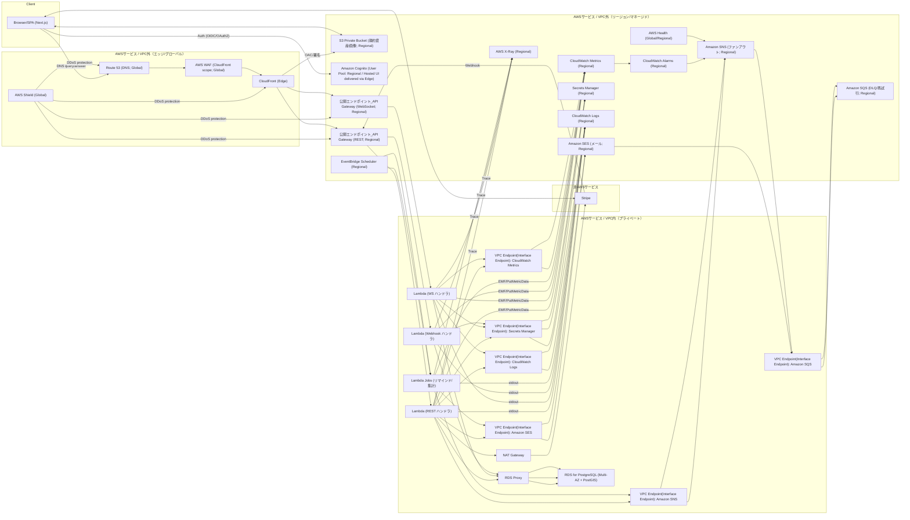

## グループ15『習い事Prime』技術要素整理（PR/FAQ準拠）

本ドキュメントは、PR/FAQで定義されたサービス機能（検索・予約・受講確認・親子別口コミ・月額チケット制・いいね共有・先生指定予約・メッセージ機能・ポイント/紹介）を実現するための技術要素を6分野で整理したものです。

---

## スコープ（PR/FAQ準拠のサービス機能）

- **アカウント/認証**: 親子それぞれのアカウント作成、家族連携、ログイン/ログアウト（保護者/子/教室/管理者ロール）。
- **検索/閲覧**: 教室・先生の検索、一覧/詳細、画像表示、エリア・ジャンル絞り込み。検索・口コミ閲覧は無料。
- **サブスク/チケット**: 月額プラン課金、毎月のチケット付与、残高表示。
- **予約**: チケットを使用した体験レッスン予約、予約確認通知（メール）。一部教室では「先生を指定した予約」が可能。
- **受講確認**: 教室側による出席確定、ユーザー側の履歴確認。
- **口コミ**: 保護者用/子ども用の別枠口コミ投稿・閲覧。施設（教室）と指導者（先生）それぞれを評価可能。同一家族の口コミを並べて表示。
- **いいね/共有**: 親子が付けた「いいね」を家族内で共有・比較できるビューを提供。
- **メッセージ**: 予約後に教室側とユーザーがやり取りできるメッセージ（スレッド）機能。
- **ポイント/紹介**: 口コミ投稿でポイント付与、紹介（リファラル）機能。一定ポイントでチケットに交換可能な仕組み。
 - **決済/通知**: Stripeによる月額課金/カード管理、適切タイミングでのメール/通知配信。

（将来/任意）例: AI推薦、決済の複数通貨対応、ネイティブアプリ。

---

## 6分野の技術要素

### Database

- **リレーショナルDB（推奨: Amazon RDS for PostgreSQL + RDS Proxy + PostGIS）**
  - 理由: 予約/チケット消費の整合性、親子/世帯の参照整合性、地理検索（PostGIS）、メッセージ/ポイントの履歴性
  - スキーマ詳細は末尾の「データモデル（PR/FAQ準拠）」を参照
  - 特徴（CS観点のタグ）:
    - PostgreSQL: リレーショナルデータベース, ACID, スキーマ, 参照整合性, SQL, インデックス
    - RDS Proxy: 接続プーリング, コネクション管理, 可用性, スケーラビリティ, マネージド
    - PostGIS: 地理空間拡張, 空間インデックス(GiST), 近傍検索, 半径検索, 距離計測

### Security

- **認証/認可**: Amazon Cognito（ユーザープール、グループ/カスタムクレームで親/子/教室/管理者ロール）。JWTをAPI層で検証
- **通信/暗号化**: ACMのTLS証明書、RDS暗号化（KMS）、S3バケット暗号化、Secrets ManagerでDB資格情報管理
- **ネットワーク保護**: AWS WAF（ボット/レート制御）、AWS Shield（DDoS）、最小権限IAM
- **コンテンツ健全性**: 口コミは「予約/受講実績ユーザー」のみ投稿可。通報フラグ＋管理者レビュー（初期は手動対応）。将来的な自動モデレーション（Comprehend/rekognition）は任意
- **公開/非公開制御**: 検索/口コミ閲覧はパブリック（レート制御あり）、予約/投稿/メッセージは認証必須。メッセージは会話参加者のみアクセス可
 - **決済保護**: Stripe Webhook署名検証（Stripe-Signature）、Idempotency-Key運用、PCI DSSはStripeに委譲
 - 特徴（CS観点のタグ）:
   - Cognito: 認証, 認可, IdP, OIDC/OAuth2, JWT, RBAC/ABAC, マネージド
   - ACM/KMS/Secrets Manager: データ暗号化(SSL/TLS通信), 鍵管理, シークレット管理, 透過暗号化
   - WAF/Shield: WAF, DDoS防御, レート制御, ボット対策
   - IAM: 最小権限, アクセス制御, ポリシーベース管理
   - コンテンツ健全性: コンテンツモデレーション, ポリシーエンフォースメント
   - 公開/非公開制御: アクセス制御, マルチテナンシー境界, オーソライゼーション

### Network

- **配信/エッジ**: Amazon CloudFront（S3フロントエンド配信、画像配信、HTTP/2, HTTP/3）
- **APIエントリ**: Amazon API Gateway（REST + WebSocket）。バックエンドはAWS Lambda
- **VPC設計**: RDSはプライベートサブネット、LambdaはVPC内からRDS Proxy経由で接続
- **DNS**: Route 53（独自ドメイン。ACMと統合）
 - **決済Webhooks**: `POST /webhooks/stripe`（API Gateway → Lambda）。署名検証、再送/順不同に耐える冪等設計
 - 特徴（CS観点のタグ）:
   - CloudFront: コンテンツ配信(CDN), エッジキャッシュ, HTTP/2, HTTP/3, オリジンシールド
   - API Gateway(REST/WebSocket): APIゲートウェイ, RESTful API, WebSocket, レート制御, 認証連携
   - VPC/RDS接続: ネットワーク分離, プライベートサブネット, セキュリティグループ, NACL
   - Route 53: DNS, ヘルスチェック, トラフィックルーティング

### Application Development

- **フロントエンド**: Next.js（静的出力）
  - 認証: Cognito Hosted UI/Amplify Auth、またはOAuthフロー直接実装
  - UI: 検索→詳細（教室/先生）→予約→メッセージ→口コミ投稿の導線。家族内の「いいね」共有ビュー、ポイント残高/交換。
- **バックエンド**: AWS Lambda（Node.js 20）+ API Gateway（REST JSON + WebSocket）
  - 主要API（例）:
    - `POST /auth/callback`（Cognito連携。初回プロビジョニング）
    - `GET /schools` / `GET /schools/{id}` / `GET /instructors/{id}`
    - `GET /classes`（エリア/ジャンル/日付で検索）
    - `GET /me/tickets` / `POST /bookings` / `GET /me/bookings` / `POST /bookings/{id}/cancel`（`lesson_schedules.instructor_id` を考慮）
    - `POST /reviews/parent` / `POST /reviews/child`（`target_type`/`target_id` 指定） / `GET /schools/{id}/reviews`
    - `POST /attendances/{bookingId}`（教室権限）
    - いいね: `POST /schools/{id}/like` / `DELETE /schools/{id}/like` / `GET /families/{id}/likes`
    - メッセージ（REST）: `POST /conversations` / `GET /conversations` / `GET /conversations/{id}/messages` / `POST /conversations/{id}/messages`
    - メッセージ（WebSocket）: 接続/切断/送受信ハンドラ（会話参加者のみ配信）
    - ポイント: `GET /me/points` / `POST /points/redeem`（ポイント→チケット交換）
    - 紹介: `POST /referrals`（招待コード発行）/ `POST /referrals/accept` / `GET /me/referrals`
    - 決済(Stripe): `POST /billing/checkout-session`（Checkoutセッション作成）/ `POST /billing/portal-session`（顧客ポータル）/ `POST /webhooks/stripe`（Webhook受信）
  - 入力検証: Zod/Yup。レート制御: API Gateway + WAF
  - トランザクション: チケット残高消費と予約作成を同一トランザクションで実装
  - 非同期処理: EventBridgeで月次チケット付与、口コミ投稿イベントに応じたポイント付与
  - 決済フロー（Stripe）:
    - 顧客作成: 初回購入でStripe Customer作成→`families.stripe_customer_id`保存
    - 購入: フロント→`/billing/checkout-session`→Stripe Checkout（サブスク）
    - 成立: Webhook `checkout.session.completed`→`subscriptions`作成/更新、初回チケット付与
    - 更新: `invoice.payment_succeeded`→次期チケット付与、`invoice.payment_failed`→`status`をon_hold等に変更
    - 解約: `customer.subscription.deleted`→契約停止・残チケット処理
    - 冪等: `payments.stripe_payment_intent_id` と `webhook_events.stripe_event_id` で重複防止
  - メール/通知タイミング:
    - 予約作成: 確認メール（保護者/教室）
    - レッスン前日: リマインド（EventBridge Scheduler）
    - 予約キャンセル: キャンセル通知
    - 受講後: 口コミ依頼
    - メッセージ受信: 既読前はWebSocketリアルタイム通知、未読が一定時間超でメール
    - サブスク開始/更新/失敗: 成功/失敗メール、カード更新依頼
    - チケット残量閾値: お知らせメール
    - 紹介/ポイント: 成立・交換通知
 - 特徴（CS観点のタグ）:
   - フロントエンド(Next.js): SPA, SSG/SSR/ISR, React, CSR/SSR併用
   - バックエンド(Lambda): サーバーレス, 関数型コンピューティング, イベント駆動, スケーリング, マネージド
   - API設計: RESTful API, JSON, 入力検証, WebSocket(リアルタイム)
   - 業務ロジック: トランザクション, ビジネスルール, バリデーション
   - 非同期連携: イベント駆動アーキテクチャ, メッセージング

### Infrastructure

- **IaC**: AWS CDK（TypeScript）。API Gateway(REST/WebSocket), Lambda, RDS, S3, CloudFront, Cognito, WAF, EventBridge, SES, SNS をコード化
- **CI/CD**:
  - バックエンド: GitHub Actions → CDKデプロイ → Lambda更新
  - フロントエンド: GitHub Actions → S3静的サイト配信 → CloudFront無効化
- **監視/運用**: CloudWatch Logs/Alarms, X-Ray（トレース）, Health Dashboard
- **可観測性**: 主要メトリクス（予約成功率、API 4xx/5xx、レイテンシ、DB接続数、チケット消費失敗率、WebSocket接続数/エラー、ポイント付与イベント処理遅延）
- **通知基盤**: Amazon SES（メール）, Amazon SNS（トピック配信/モバイルプッシュ連携）, Amazon SQS（DLQ/再試行）
- **決済/通知運用**: Secrets Manager（`STRIPE_API_KEY`/`STRIPE_WEBHOOK_SECRET`）、SESドメイン認証、Webhook LambdaのDLQ、EventBridge Scheduler（リマインド/ダイジェスト）
 - 特徴（CS観点のタグ）:
   - CDK: IaC(インフラ自動化), 宣言的構成, 再現性, バージョン管理
   - CI/CD: 継続的インテグレーション, 継続的デリバリ, 自動デプロイ
   - 監視/可観測性: ログ, メトリクス, トレーシング, 分散トレーシング, ダッシュボード

### Storage

- **オブジェクトストレージ**: Amazon S3（教室/先生画像、口コミ画像）
  - アップロードはフロント→`PUT`プレサインドURL（サイズ/拡張子制限）
  - 配信はCloudFront。キャッシュ無効化は運用フローで最小化
 - 特徴（CS観点のタグ）:
   - S3: クラウドストレージ(オブジェクトストレージ), 静的ホスティング, バージョニング, ライフサイクル, サーバーサイド暗号化, プリサインドURL

---

## データモデル（PR/FAQ準拠）

- 概要スキーマ（詳細は実装時にマイグレーションで管理）
- **users**: `id, type(parent|child|school_owner|admin), email, name, created_at`
  - 役割: 利用者（保護者/子/教室オーナー/管理者）
  - 列の意味: id(ユーザーID), type(ロール), email(連絡先), name(表示名), created_at(作成時刻)
  - 主な制約: PK(id), UNIQUE(email)
- **families**: `id, parent_user_id, stripe_customer_id`
  - 役割: 家族（世帯）
  - 列の意味: id(家族ID), parent_user_id(保護者ユーザーID), stripe_customer_id(Stripe顧客ID)
  - 主な制約: PK(id), FK(parent_user_id→users.id), UNIQUE(stripe_customer_id)
- **family_members**: `family_id, child_user_id`
  - 役割: 家族と子ユーザーの関連
  - 列の意味: family_id(家族ID), child_user_id(子ユーザーID)
  - 主な制約: PK(family_id, child_user_id), FK(family_id→families.id), FK(child_user_id→users.id)
- **schools**: `id, name, area, category, description, image_key, location`
  - 役割: 教室（施設）
  - 列の意味: id(教室ID), name(名称), area(エリア), category(ジャンル), description(紹介文), image_key(S3キー), location(位置Point)
  - 主な制約: PK(id)
- **instructors**: `id, school_id, name, profile, image_key`
  - 役割: 指導者（先生）
  - 列の意味: id(先生ID), school_id(所属教室), name(氏名), profile(紹介), image_key(S3キー)
  - 主な制約: PK(id), FK(school_id→schools.id)
- **classes**: `id, school_id, title, capacity, duration_min`
  - 役割: クラス（講座の種類）
  - 列の意味: id(クラスID), school_id(教室ID), title(タイトル), capacity(定員), duration_min(所要分)
  - 主な制約: PK(id), FK(school_id→schools.id)
- **lesson_schedules**: `id, class_id, instructor_id, start_at, end_at`
  - 役割: 開催スケジュール（日時枠）
  - 列の意味: id(枠ID), class_id(クラスID), instructor_id(担当先生ID), start_at(開始), end_at(終了)
  - 主な制約: PK(id), FK(class_id→classes.id), FK(instructor_id→instructors.id), UNIQUE(class_id, start_at)
- **subscriptions**: `id, family_id, plan, status, current_period_start, current_period_end, stripe_subscription_id`
  - 役割: 月額契約
  - 列の意味: id(契約ID), family_id(家族ID), plan(プラン), status(状態), current_period_start(期間開始), current_period_end(期間終了), stripe_subscription_id(Stripe契約ID)
  - 主な制約: PK(id), FK(family_id→families.id), UNIQUE(stripe_subscription_id)
- **payments**: `id, family_id, stripe_payment_intent_id, amount, currency, status, created_at, meta`
  - 役割: 個別決済（初回/更新/失敗）
  - 列の意味: id(決済ID), family_id(家族ID), stripe_payment_intent_id(Stripe PI), amount(金額), currency(通貨), status(状態), created_at(発生), meta(付随情報)
  - 主な制約: PK(id), FK(family_id→families.id), UNIQUE(stripe_payment_intent_id)
- **webhook_events**: `id, stripe_event_id, type, payload, received_at, processed_at`
  - 役割: Stripe Webhookイベント受信
  - 列の意味: id(受信ID), stripe_event_id(イベントID), type(種別), payload(生データ), received_at(受信), processed_at(処理完了)
  - 主な制約: PK(id), UNIQUE(stripe_event_id)
- **ticket_balances**: `id, family_id, month, balance`
  - 役割: 月次チケット残高
  - 列の意味: id(残高ID), family_id(家族ID), month(対象月), balance(残枚数)
  - 主な制約: PK(id), FK(family_id→families.id), UNIQUE(family_id, month)
- **bookings**: `id, user_id(child), schedule_id, status, consumed_tickets, created_at`
  - 役割: 子ユーザーの予約
  - 列の意味: id(予約ID), user_id(子ユーザーID), schedule_id(スケジュールID), status(状態), consumed_tickets(消費枚数), created_at(作成)
  - 主な制約: PK(id), FK(user_id→users.id), FK(schedule_id→lesson_schedules.id), UNIQUE(user_id, schedule_id)
- **attendances**: `id, booking_id, status(attended|absent)`
  - 役割: 出欠
  - 列の意味: id(出欠ID), booking_id(予約ID), status(出席/欠席)
  - 主な制約: PK(id), FK(booking_id→bookings.id)
- **reviews_parent / reviews_child**: `id, booking_id, target_type(school|instructor), target_id, rating, comment, created_at`
  - 役割: 口コミ（保護者/子ども）
  - 列の意味: id(口コミID), booking_id(予約ID), target_type(対象種別), target_id(対象ID), rating(評点), comment(本文), created_at(投稿)
  - 主な制約: PK(id), FK(booking_id→bookings.id), UNIQUE(booking_id)
- **likes**: `id, user_id, school_id, created_at`
  - 役割: いいね（お気に入り）
  - 列の意味: id(いいねID), user_id(ユーザーID), school_id(教室ID), created_at(付与時刻)
  - 主な制約: PK(id), FK(user_id→users.id), FK(school_id→schools.id), UNIQUE(user_id, school_id)
- **conversations**: `id, booking_id, family_id, school_id, created_at`
  - 役割: メッセージ会話スレッド
  - 列の意味: id(会話ID), booking_id(予約ID), family_id(家族ID), school_id(教室ID), created_at(作成)
  - 主な制約: PK(id), FK(booking_id→bookings.id), FK(family_id→families.id), FK(school_id→schools.id)
- **messages**: `id, conversation_id, sender_user_id, body, created_at, read_at`
  - 役割: 会話内メッセージ
  - 列の意味: id(メッセージID), conversation_id(会話ID), sender_user_id(送信者ID), body(本文), created_at(送信), read_at(既読)
  - 主な制約: PK(id), FK(conversation_id→conversations.id), FK(sender_user_id→users.id)
- **points_transactions**: `id, family_id, type(review|referral|redeem), amount, created_at, meta`
  - 役割: ポイント取引履歴
  - 列の意味: id(取引ID), family_id(家族ID), type(種別), amount(増減), created_at(記録), meta(付随情報)
  - 主な制約: PK(id), FK(family_id→families.id)
- **referrals**: `id, referrer_family_id, code, referred_family_id, status(pending|accepted), created_at`
  - 役割: 紹介（リファラル）
  - 列の意味: id(リファラルID), referrer_family_id(紹介元家族ID), code(招待コード), referred_family_id(紹介先家族ID), status(状態), created_at(作成)
  - 主な制約: PK(id), FK(referrer_family_id→families.id), FK(referred_family_id→families.id), UNIQUE(code)
---
## アーキテクチャ構成: 機能別フロー

- 検索/閲覧（学校・先生・地理）
  - フロント（Next.js）→ API Gateway(REST) → Lambda → RDS(PostgreSQL/PostGIS)
  - キーワードはpg_trgm+GIN、地理はPostGIS（ST_DWithin/Distance）。`schools_stats`等の集約でランキング

- 画像アップロード/配信
  - フロント→バックエンドでプリサインドURL発行→ S3にPUT → CloudFrontから配信

- 認証/認可
  - Cognito Hosted UIでログイン→JWTをAPIに付与→Authorizer検証→Lambda実行、ロール/属性で権限制御

- 予約（チケット消費）
  - `POST /bookings` → LambdaがRDSトランザクション：残高検証→二重予約チェック(UNIQUE)→残高減算→予約作成
  - 成功後にSESで確認メール、EventBridge Schedulerに前日リマインド登録

- 出席確定/口コミ依頼
  - 教室側`POST /attendances/{bookingId}`→RDS更新→受講後に口コミ依頼メール（SES）

- メッセージ（チャット）
  - スレッド/履歴はREST、送受信はWebSocket。会話参加者のみに配信。未読継続でメール通知

- 口コミ（親/子）
  - `POST /reviews/(parent|child)`→RDSに保存（各`UNIQUE(booking_id)`）

- いいね/共有
  - `POST /schools/{id}/like`→RDS（`UNIQUE(user_id, school_id)`）。家族共有は`family_id`で集約表示

- ポイント/紹介
  - イベント契機で`points_transactions`記録。残高は集計ビューで提供

- 決済/サブスク（Stripe）
  - フロント→`/billing/checkout-session`→Stripe Checkout
  - Webhook(`/webhooks/stripe`)で `checkout.session.completed`/`invoice.*`を受信→冪等処理→`subscriptions`/`payments`更新とチケット付与
  - 失敗時はメールでカード更新依頼

- 通知（メール/プッシュ/SMS）
  - Lambda→SESで送信。ファンアウトが必要な場合はSNSトピック経由。失敗はSQS DLQに退避

- 運用/監視
  - CloudWatch Logs/Alarms、X-Rayトレース。機能別ダッシュボード（検索/予約/メッセージ/決済）

---

## アーキテクチャ構成: 全体フロー

- 注記: S3はVPCの外にあるリージョンサービスです（バケットはVPC内に存在しません）。フロント配信はCloudFront→S3（OAC/署名URL）で私有化しアクセス。今のところ無いが、将来的に機能拡張するにあたりバックエンドからアクセスする場合はVPCエンドポイント（Gateway）経由でプライベートアクセスする。

- 非AWSサービス
  - Stripe（外部決済）

- VPC外（エッジ/グローバル）
  - Route 53（独自ドメイン; Global DNS）
  - CloudFront（エッジ配信: フロント/画像配信）
  - AWS WAF（CloudFrontスコープ; エッジ評価）

- VPC外（リージョン/マネージド）
  - Amazon S3（オブジェクトストレージ; Regional）
  - Amazon Cognito（User Pool: Regional / Hosted UI: Edge配信）
  - Amazon SES / SNS / SQS（メール / 通知 / DLQ; Regional）
  - Amazon EventBridge Scheduler（Regional）
  - AWS Secrets Manager（シークレット管理; Regional）
  - Amazon CloudWatch Logs / Metrics（監視; Regional）

- VPC内（プライベート）
  - サブネット: アプリ用プライベートサブネット、DBサブネット（別AZ）
  - セキュリティ: セキュリティグループ、NACL、VPCエンドポイント（Secrets Manager/CloudWatch Logs/CloudWatch Metrics/SES/SNS/SQS）
  - 送信経路: NAT Gateway（外部SaaS: Stripe 等へのアウトバウンド）
  - RDS for PostgreSQL（マルチAZ, PostGIS）+ RDS Proxy
  - Lambda（VPC接続: REST/メッセージWS/決済Webhook/ジョブ(バッチ処理など)）

- 監視/運用の組み込み
  - トレース: Lambda → X-Ray（SDK/統合）
  - ログ/メトリクス: Lambda 標準出力 → CloudWatch Logs、EMF/PutMetricData → CloudWatch Metrics
  - アラーム/通知: CloudWatch Alarms → SNS（運用通知/ページャ連携）
  - プラットフォーム状況: AWS Health（イベント通知/メンテ情報）

- 公開エンドポイント（VPC外）
  - AWS Shield: DDoS緩和

 - データフロー（高レベル）
  0) DNS解決 → 静的配信（フロント/画像閲覧）/API 呼び出し（REST/WS）: クライアント → Route 53（A/AAAA/CNAME）→ クライアント→ WAF → CloudFront → S3/[API Gateway...]
  1) API 呼び出し（REST/WS）: 
    1.1) DBアクセス: クライアント → Route 53 → クライアント → WAF → CloudFront → API Gateway → Lambda → RDS Proxy → RDS
  2) 認証（Cognito）: ブラウザ → Cognito Hosted UI（Cognitoドメイン; 自社WAFは経由しない）→ JWT 取得 → 以降の API は 1) 経路
  3) 画像 （0) の拡張）:
     - アップロード: 
      1. リクエスト: ブラウザ → ROUTE53 → CF API Gateway → Lambda「fileName / contentType / 期待サイズ などを送る」
      2. プリサインドURL発行: Lambda が S3 SDK で プリサインドURL を生成「例：有効期限300秒、キーuploads/user123/abc.jpg、Content-Type固定、最大サイズ制約、ACL禁止 等」
      3. 直PUT: ブラウザ → S3（プリサインドURL; CloudFront/WAF は経由しない）
     - 配信（閲覧）: ブラウザ → WAF → CloudFront → S3（1 と同一路）
  4) 決済（1) の拡張）:
     - Checkout Session 作成(API) 「目的：フロントから『決済したい』→ サーバーが Stripe の Checkout Session を作成して URL/ID を返す」: ブラウザ → Route53(DNS) → Shield → CloudFront(WAFスコープ) → API Gateway(Regional) → Lambda(LREST) → VPCE_SM → Secrets Manager（Stripe鍵取得） → Lambda(LREST) →（VPC内なら NAT →）Internet → Stripe（ブラウザに checkout_url / session_id を返却①）
     注意: 金額はサーバー側で再計算／Idempotency-Key 付与
     - ユーザーリダイレクト/完了: ブラウザ ↔ Stripe(Hosted)（① で返却された checkout_url に遷移・カード入力・決済実行）→ success_url / cancel_url にリダイレクト（ブラウザ → Route53 → Shield → CloudFront → フロント）
     任意（推奨）: 検証APIで暫定確認 → ブラウザ → Route53 → Shield → CloudFront(WAF) → API Gateway → Lambda(LREST) → Stripe（Session/PaymentIntent 再取得）
     注意: 最終確定は Webhook 側で行う
     - Webhook 受信: Stripe → Shield → API Gateway(Regional; 本システムではCFにのみWAFをアタッチしているが、ベストプラクティスとしては、このエンドポイントにも WAF を“直接”付与することを強く勧める) → Lambda(LWH) → VPCE_SM → Secrets Manager（endpoint secret 取得） → Lambda(LWH) 署名検証 → RDS Proxy → RDS（冪等更新） →（必要に応じて SNS/SQS へファンアウト）→ 2xx 即返
     注意: event.id の冪等記録／重い処理は非同期（SQS/DLQ）／CloudFrontは挟まない
  5) 通知（内部アウトバウンド）:
     - Lambda(LREST) →  VPCE_SES → SES（メール）→ SQS（DLQ）
     - Lambda(LREST) →  VPCE_SNS → SNS（ファンアウト）→ SQS（DLQ）
     - 外向き通信のため WAF/CloudFront は関与しない
  6) バッチ/リマインド（内部イベント）:
     - EventBridge Scheduler → Lambda（ジョブ）→ VPCE_SES → SES
     - EventBridge Scheduler → Lambda（ジョブ）→ VPCE_SNS → SNS
     - 必要に応じて内部で API（1) 経路）や RDS を呼び出し

- 運用/可観測性
  - CloudWatch Logs/Alarms, X-Ray, Health Dashboard, Secrets Manager（Stripe鍵/DB資格情報）

