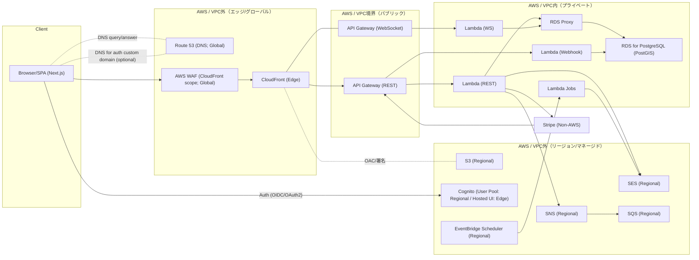

## 認証とDNSフロー整理（Route 53 / Cognito / WAF / CloudFront）

> 元質問: 「U --> R53["Route 53 (DNS)"] / U -->|"Auth (OIDC/OAuth2)"| COG の入口で二股は適切？Route 53 は何ができて、ここでの役割は？なぜ認証の矢印にR53を挟まないのか？」

---

### 用語と前提
- **Route 53**: 権威DNS（グローバルAnycast）。A/AAAA/CNAME/ALIASで「名前解決」だけを行う。HTTPを中継しない。
- **CloudFront**: エッジロケーション（PoP）でのコンテンツ配信（キャッシュ/TLS終端）。
- **AWS WAF**: ルール適用エンジン。CloudFrontスコープに付けると「エッジ」で評価、RegionalスコープはALB/API Gateway等の「リージョン」で評価。
- **Amazon Cognito**: 認証/認可(IdP)。User Poolはリージョンリソース。Hosted UIはAWS管理のCloudFrontで配信（あなたのWAF/CFではない）。
- **OIDC/OAuth 2.0**: 認証/認可プロトコル。SPAは Authorization Code + PKCE が基本。発行されるトークンはJWT。

---

### なぜ入口で二股か（結論）
- クライアントの入口は同じでも「あなたの配信/API（WAF→CloudFront→API Gateway）」と「Cognito（認証）」は到達先・責任境界が異なるため、二股で描くのが正しい。

---

### Route 53 の役割と、Cognitoの矢印に挟まない理由
- Route 53 は「DNS解決のみ」関与し、通信の中継点にはならない。
- CognitoのHosted UIはAWS管理のエッジ配信。デフォルトドメインではあなたのRoute 53は関与しない。
- Cognitoにカスタムドメインを設定する場合は、Route 53は「DNS応答のみ」関与（CNAME/ALIAS）。それでも通信は「ブラウザ → Cognito」に直接流れ、あなたのWAF/CloudFrontは介在しない。
- したがって、図でCognitoの矢印に常にRoute 53ノードを直列に挟むと誤解を招く。DNSは「UI ↔ Route 53（問い合わせ/応答）→ UI → 宛先」という“案内板”の役割に留めて表現する。

---

### 認証でWAF/CloudFrontが介在しない理由（順を追って）
1. ブラウザは `auth.example.com` をDNS解決 → Route 53は“解決のみ”。
2. 解決結果のCognito Hosted UI（AWS管理のエッジ）にブラウザが直接HTTPS接続（TLS終端はCognito側）。
3. OIDC/OAuthのドメイン整合性（redirect_uri、クッキー属性、PKCE等）が厳格で、中継プロキシ（あなたのCloudFront/WAF）挿入はサポート外。
4. WAFは「適用先」に依存して動作。あなたが所有するCloudFront/ALB/APIGWには付けられるが、Cognito Hosted UIには付けられない。
5. よって、認証フェーズの通信にはWAF/CloudFrontは介在しない。認証後のAPI呼び出しからWAF/CFが有効になる。

---

### PoP（配置拠点）の独立性
- CloudFrontのエッジPoP、Route 53のAnycast DNSエッジ群は役割も運用も別。共有前提で考えない。
- WAFはPoPを持たず、適用スコープ（CloudFront/Regional）に応じて実行場所が変わる。

---

### 分類と“距離感”（近接性）
- 非AWSサービス: Stripe（Hosted/外部）
- AWS/VPC外（エッジ/グローバル）: Route 53（Global DNS）, CloudFront（Edge）, WAF（CloudFrontスコープ）
- AWS/VPC外（リージョン/マネージド）: S3（Regionalデータ）, Cognito（User Pool: Regional / Hosted UI: Edge配信）, SES/SNS/SQS/EventBridge（Regional）
- AWS/VPC境界（パブリック）: API Gateway（REST/WS; Regional終端）
- AWS/VPC内（プライベート）: Lambda（REST/WS/Webhook/Jobs）, RDS/PostGIS, RDS Proxy, VPC Endpoint(S3/Secrets/CloudWatch)

---

### 代表フロー（Mermaid）

---

### まとめ（Q&A）
- 二股は適切か: 適切。あなたの配信/APIとCognitoは責任境界が違うため。
- Route 53の役割: DNS解決のみ（案内）。通信の中継はしない。
- なぜCognito矢印にR53を挟まない: デフォルトドメインでは関与なし。カスタムドメインでも“DNS解決のみ”関与し、実通信はUI→Cognitoに直行。あなたのWAF/CFは非介在。
- WAFの場所: CloudFrontスコープはエッジで評価。RegionalはALB/API Gateway側で評価。
- PoPは独立か: 基本独立。CloudFrontのエッジPoPとRoute 53のDNSエッジは別。WAFは適用先で実行。

